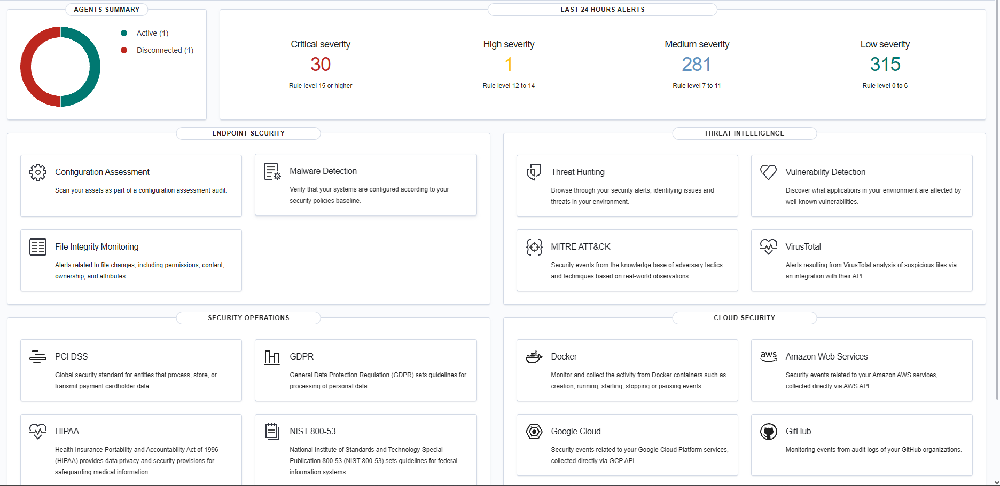
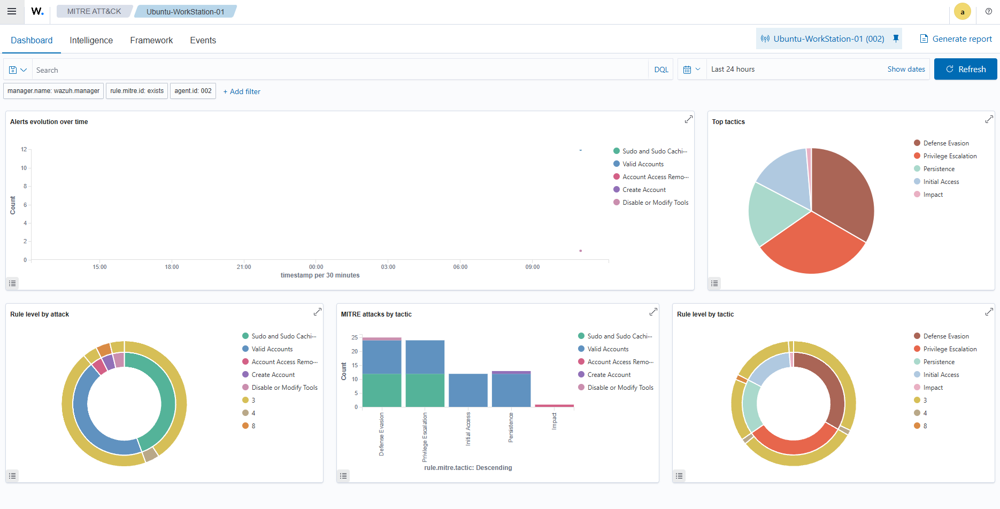
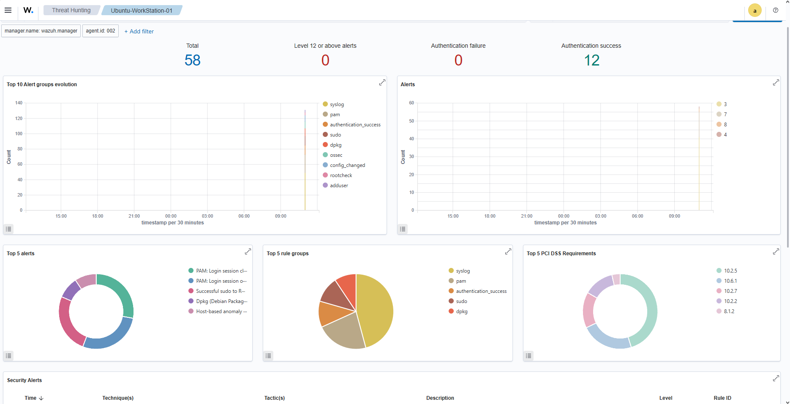

# 🛡️ Enterprise SOC & Threat Detection Lab (Wazuh SIEM + Sysmon + Atomic Red Team)

## 📌 Project Overview
This project demonstrates an enterprise-grade **Security Operations Center (SOC)** detection pipeline built on a hybrid network environment. The deployment monitors live telemetries across heterogeneous endpoints (Windows 10 & Ubuntu Linux), ingests kernel-level process and authentication events into a centralized **Wazuh SIEM (Docker)** cluster, validates detection capabilities against **MITRE ATT&CK** techniques using **Atomic Red Team**, and executes automated containment via **Active Response**.

---

## 🏗️ Architecture & Network Topology

                      +-------------------------------------------------------+
                      |              Wazuh SIEM Manager (Docker)              |
                      |    [ Threat Hunting Engine & MITRE ATT&CK Matrix ]    |
                      +---------------------------^---------------------------+
                                                  |
                                  TLS Ingestion (Port 1514/1515 TCP)
                                                  |
                       +--------------------------+--------------------------+
                       |                                                     |
             +---------+-----------+                               +---------+-----------+
             |     Windows 10      |                               |   Ubuntu Workstation|
             |     (Local Host)    |                               |    (Remote Laptop)  |
             | Wazuh Agent + Sysmon|                               | Wazuh Agent + Auditd|
             +---------------------+                               +---------------------+

* **SIEM / SOC Manager:** Wazuh 4.8.x Single-Node Cluster containerized via Docker Desktop.
* **Windows Endpoint:** Wazuh Agent paired with Microsoft Sysmon (modular process creation & network monitoring).
* **Linux Endpoint:** Wazuh Agent coupled with Linux `auditd` and PAM authentication hooks.
* **Adversary Simulation:** Red Canary's Atomic Red Team (executing TTPs mapped to MITRE ATT&CK).

---

## ⚔️ MITRE ATT&CK Mapping & Emulation Matrix

| MITRE Tactic | Technique ID | Technique Name | Emulated Action / Vector | Ingestion Source |
| :--- | :--- | :--- | :--- | :--- |
| **Discovery** | `T1087.001` / `T1033` | Local Account & System Discovery | Enumerated `/etc/passwd`, `/etc/shadow`, and `whoami` | Linux Syslog / Sysmon EID 1 |
| **Execution** | `T1059.001` | PowerShell Bypass | Execution Policy bypass execution | Sysmon EID 1 |
| **Privilege Escalation** | `T1548.003` | Sudo & Sudoers Tampering | Unauthorized modification of `/etc/sudoers.d/` | PAM / Linux Auditd |
| **Persistence** | `T1053.003` | Scheduled Task / Cron Job | Malicious reverse shell persistence via `crontab` | Linux Cron Syslog |
| **Defense Evasion** | `T1562.001` | Disable or Modify Tools | Tampering with security daemons | Wazuh Rule Engine |

---

## 🛑 Automated Incident Response (Active Response)

Configured an automated host-based containment loop on the Wazuh Manager:
* **Trigger Condition:** Repeated authentication failures or high-severity privilege abuse (Wazuh Rule IDs `5402`, `5710`, `5712`).
* **Active Response Command:** `firewall-drop`
* **Containment Execution:** The agent on Ubuntu dynamically drops inbound/outbound packets from the offending source using local firewall rules (`iptables`) for a defined timeout window.

---

## 📊 Telemetry & Detection Artifacts

### 1. Centralized SOC Overview
Active agent monitoring and real-time alert aggregation across severity levels:

### 2. Linux Adversary Emulation & MITRE Mapping
Observed tactical distribution across Defense Evasion, Privilege Escalation, and Persistence:

### 3. Incident Investigation & Threat Hunting
Deep log inspection of PAM authentication sessions and privilege escalation events:

